# Intro_to_Prometheus_Monitoring-_Collecting-_Storing-_and_Visualizing_Metrics
To demonstrate how Prometheus can monitor system performance, collect metrics, and trigger alerts, while showing integration with Grafana for visualization.

## 📸 Project Diagram "PROMETHEUS ARCHITECTURE" 
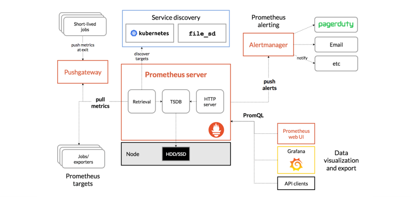

By the end of the project, you’ll:
   - Set up a full Prometheus monitoring stack.
   - Monitor your system (or containerized app).
   - Visualize data on Grafana dashboards.
   - Configure alerts with Alertmanager.

## 🏗️ 1. System Architecture Overview

### Monitoring key components and description:
1. `Metrics:` Monitoring is all about collecting and gathering matrics. Metrics are numeric data about system/app performance (e.g., CPU utilization, memory usage, request count). `So matrics basically provide data on the performance of your system`
2. `log`: Are detailed `records of events` that happen inside your system, application, or infrastructure. (e.g., Like in serverless computing we check the logs with CloudWatch log). Every time a server, container, or app performs an action, it can write a line to a log file.
    * Help debug errors or performance problems.
    * Provide a history of events (what happened and when).
    * Show the context of issues that metrics alone can’t reveal.
3. `Alerts`: It's how you notify your user when a threshold is met. Alerts are `automated notifications` triggered when metrics or conditions meet certain rules. (e.g., “If CPU usage > 80% for more than 2 minutes, send an alert.”).
    * They help detect problems early before they become outages.
    * Notify you when something is wrong (high latency, low memory, failed service, etc.).
    * Enable proactive monitoring — respond before users notice issues.
4. `Dashboards`: Is the visual representation of you metrics (e.g., “Just like a security guy with big monitor and bunch of cameras able to see everything that happen in the building.”). Dashboards are `visual interfaces` that display key performance metrics in `real time`
    * Provide a quick overview of the system.
    * Allow correlation between metrics (e.g., traffic spike → CPU spike → error rate increase).
 
#### In a complete monitoring setup, they’re connected like this:
- Metrics (Prometheus) → collected continuously.
- Dashboards (Grafana) → visualize metrics.
- Alerts (Alertmanager) → trigger notifications on anomalies.
- Logs (Loki/ELK) → used to investigate what caused the issue.

So the workflow is:

Dashboard shows a problem → Alert is triggered → You check logs → You fix the root cause.


## 🧩 2. What is Prometheus?

`Prometheus` is an open-source monitoring and alerting tool originally built by `SoundCloud`. 
   * It’s widely used in DevOps, Kubernetes, and Cloud environments to collect and query metrics.
   * What makes it different is that it collects and stores its metrics as tme series data. i.e. metrics information is stored with the timestamp at which it was recorded, alongside optional `key-value pairs`(because metrics you have alot of data so it makes it flexibility to access that data with programming language like `Python or Java`) called labels

### Key Features:
- `Multi-dimensional Data Model`: Prometheus is flexible because it store it data as a `key-value pairs`. So users have the possibility to associate `labels` to the data that they get and make it easy to analyse the data. 
- `Data Scraping`: Here, Prometheus will ask EC2 (e.g., what is the CPU) at this time then collect the data called matrics and send them back. SO prometheus will be like a `server` and the target system will be the `client`. 
- `Powerful query language (PromQL)`: This language allow you to manipulate, query, to retrieve and analyze `time series data` that are store on the Prometheus server.
- `Alerting and AlertManager`: Here you can set alerting (e.g., “If CPU usage reache a threshold of 80% you want to be alert for it, send an alert maybe on cell phone, email, slack or whatever.”). Easy integration with Grafana
- `Scalability`: Prometheus is designed to scale you can add instance when the workload becomes heavy. 
- Easy integration with Grafana.


### Main components and description:

1. `Prometheus Server`: `Core component` that scrapes metrics and stores them in a time-series database. It's responsible for colleting and storing querying the metrics. It periodically check for metrics data then store it localy and it available for you to query.
2. `Exporters`: It's and agents that you install on the target system (EC2 instance) that is responsible of exposing the metrics (e.g., node_exporter for system metrics, app-specific exporters).
3. `Prometheus Alertmanager`: Alertmanager is the one that handle alerts. So you need to install this to send you notification (e.g., send email, Slack, PagerDuty)
4. `Prometheus Web UI`: When you setup a server this Prometheus UI will give you a UI, which makes it easy for you to visualize and query it. So, It's just a basic web-based interface that allow you to run those PromQL queries on the UI don't need to do that from the CLI. 
5. `Data Storage`: Prometheus have it on `Time-series database (TSDB) built-in(already set up)` where it store the collected metrics in the form of `key-value pair`. This storage is optimized for high volume so don't have to wory about latency and all those.
6. Pushgateway: Receives metrics from short-lived jobs that can’t be scraped directly.
7. Service Discovery: Automatically finds what to monitor (e.g., Kubernetes, EC2 instances).
8. Grafana: Visualization dashboard for Prometheus metrics.

#### Main differences between Prometheus vs AWS CloudWatch

|Feature |              Prometheus          |          AWS CloudWatch       |
| --     | -------------------------------- | ----------------------------- |
| Type   |Open-source monitoring & alerting toolkit |Managed monitoring service by AWS |
| Metric Storage   |Uses local Time Series Database (TSDB) |Uses AWS-managed storage (no control over internal storage) |
| Query Language   |PromQL (Prometheus Query Language) — very flexible |CloudWatch Metric Math — less powerful and flexible |
| Deployment   |You install and manage it yourself (e.g., on EC2, Kubernetes, or Docker) |Fully managed by AWS — no installation needed |
| Alerting System   |Alertmanager — powerful and customizable |CloudWatch Alarms — simpler, managed alerts |
| Cost   |Free (open-source) but you pay for infrastructure |Pay-per-use (based on metrics, logs, and API calls) |


## 🪜 3. Project Setup Steps
### Step 1 — Prometheus Server Installation. 
1. Launched 2 ubuntu server: (Prometheuse-ubuntu-server and target-host)

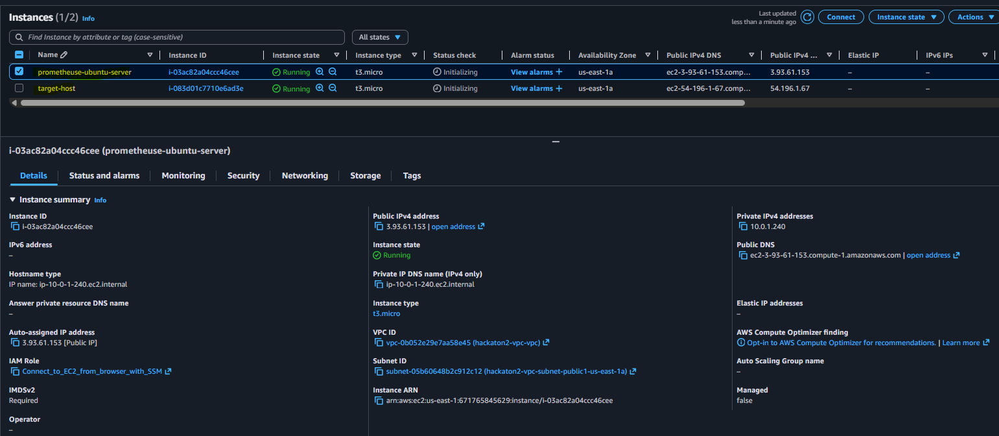


2. Take up you privilage on your Prometheuse-ubuntu-server. 
```
sudo su - ubuntu
```
3. let rename our ubuntu server to "prometheuse". You can as well use the other command 
```
sudo hostname prometheuse
```
```
sudo hostnamectl set-hostname prometheuse
```
4. For the command to take effect you need to exit(with the command bellow) and login again(with the fist command above)
```
exit
```
```
sudo su - ubuntu
```
5. Now, let connect as a sudo (the root user) with the command below 
```
 sudo -i
```
6. We need to go to the officail documentation [this page](https://prometheus.io/download/) we copy the link on `Linux OS`. 
- Before that we need to create a folder called `downloads` then you cd into it
```
mkdir downloads
```
```
cd downloads
```
- You use the command below to download prometheus in that folder just created
```
wget https://github.com/prometheus/prometheus/releases/download/v3.5.0/prometheus-3.5.0.linux-amd64.tar.gz
```
```
ls -l
```
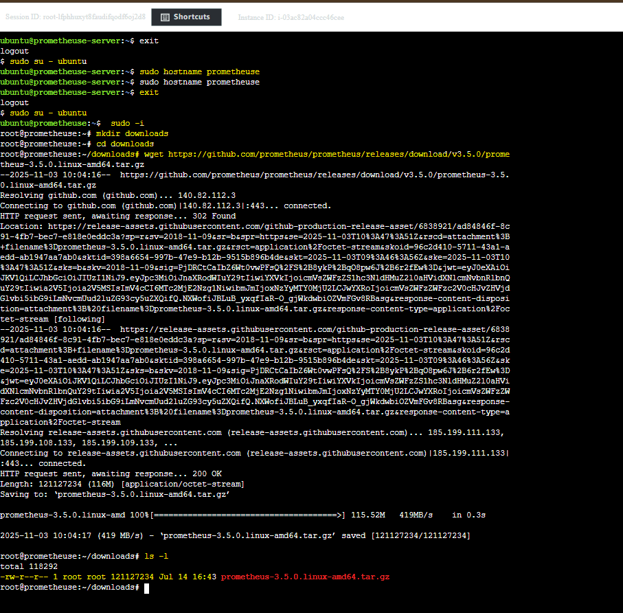

7. We will still create another folder called `prometheus-server` just because we want our work to be organized. 
```
cd ..
```
```
mkdir prometheus-server
```
```
cd prometheus-server
```
8. Now let `unzip` it. We can first use the command help to see which command to use. `x = extract`, `f = the file you will like to extract`, `v = verbel in case of error message wil let you know` `z = for zip file`
```
tar --help
```
```
tar -xvzf ~/downloads/prometheus-3.5.0.linux-amd64.tar.gz
```
```
ls -l
```
9. Let rename our download prometheus `prometheus-3.5.0.linux-amd64.tar.gz` into a simple name called `prometheus`
```
mv prometheus-3.5.0.linux-amd64 prometheus
```
```
ls -l
```
10. let call the binary file `prometheus` found inside our prometheus unzip file and check if prometheus is install 
```
./prometheus --version
```
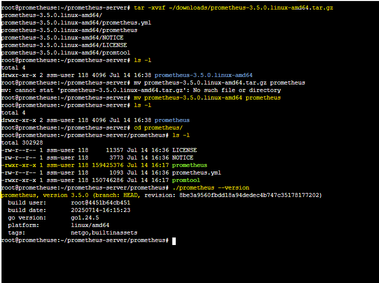

### Step 2 — Run Prometheus Server.
1. To run the prometheus server just tap the command below 
```
./prometheus
```
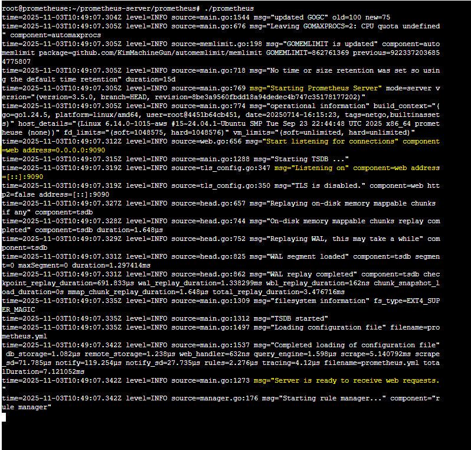

2. To be able to see the web url go to port `9090` by default using your `public ip address of your ubuntu server`.
```
3.93.61.153:9090
```
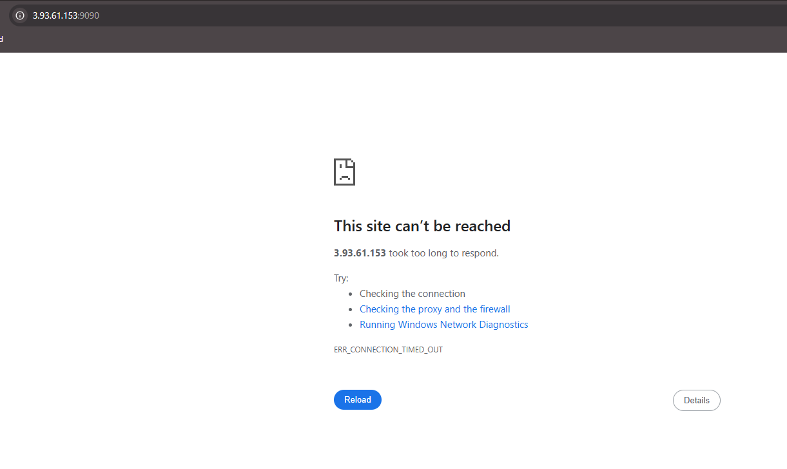

3. But the prometheus don't show on our website. This is because we did not allow port `9090` on our `security group`\
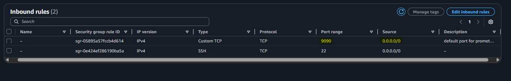

4. let go back to our website and refreh
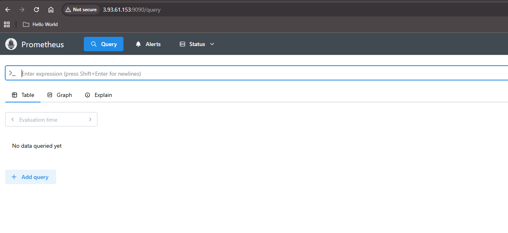


### What Is the Prometheus Config File?
The `Prometheus configuration file (named prometheus.yml)` is a yaml file that describe how you will like to collect and process your metrics. Can also be defined as the main configuration file that tells Prometheus what to monitor, how to scrape data, and where to send alerts. 
- let cat into our config file 
```
cat prometheus.yml
```

### Run Prometheus in the background 
To fix the issue of every time we exit the server goes down, we can run the Prometheus process in the background. If you run that Prometheus server in the background, It means if we leave the Linux page Prometheus server will still be running. That is just more efficient way of having it  
- let check the process first. the ommand below will give you all the process that are runing on linux. 
```
 ps
```
- Check Prometheus before
```
 ps -ef | grep prometheus
```
- RUN PROMETHEUS IN THE BACKGROUND. `nohup` will help you run Prometheus on the bacground and if something failed generate the log in that location 
```
 nohup ./prometheus > prometheus.log 2>&1 &
```
- CHECK status after
```
 ps -ef | grep prometheus
```
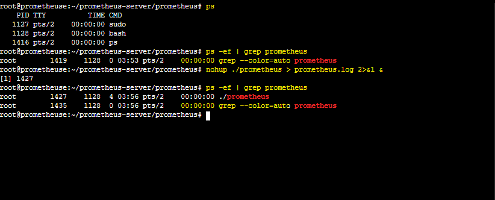

 
### Node Exporters?
`Exporters`: It's and `agents` that you install on the target system (EC2 instance) that is responsible of exposing the metrics (e.g., node_exporter for system metrics, app-specific exporters).

So you need to install `node exporters` on the `target-host` it could be on `ubuntu, linux, Red Hat or whatever ec2 instance` for him to be able to expose the metrics.

#### Does Ansible require and Agent to work??? No, because Ansible is agentless but Prometheus is not agentless because he need the Node Exporters agent to be install on the machine. 

1. Take up you privilage on your target-host. 
```
sudo su - ubuntu
```
2. let rename our ubuntu server to "prometheuse". You can as well use the other command 
```
sudo hostname target-host
```
```
sudo hostnamectl set-hostname target-host
```
3. For the command to take effect you need to exit(with the command bellow) and login again(with the fist command above)
```
exit
```
```
sudo su - ubuntu
```
4. Now, let connect as a sudo (the root user) with the command below 
```
 sudo -i
```
5. We need to go to the officail documentation [this page](https://prometheus.io/download/) we copy the link on `Linux OS`. 
- Before that we need to create a folder called `downloads` then you cd into it
```
mkdir downloads
```
```
cd downloads
```
- You use the command below to download prometheus in that folder just created
```
wget https://github.com/prometheus/node_exporter/releases/download/v1.10.2/node_exporter-1.10.2.linux-amd64.tar.gz
```
```
ls -l
```
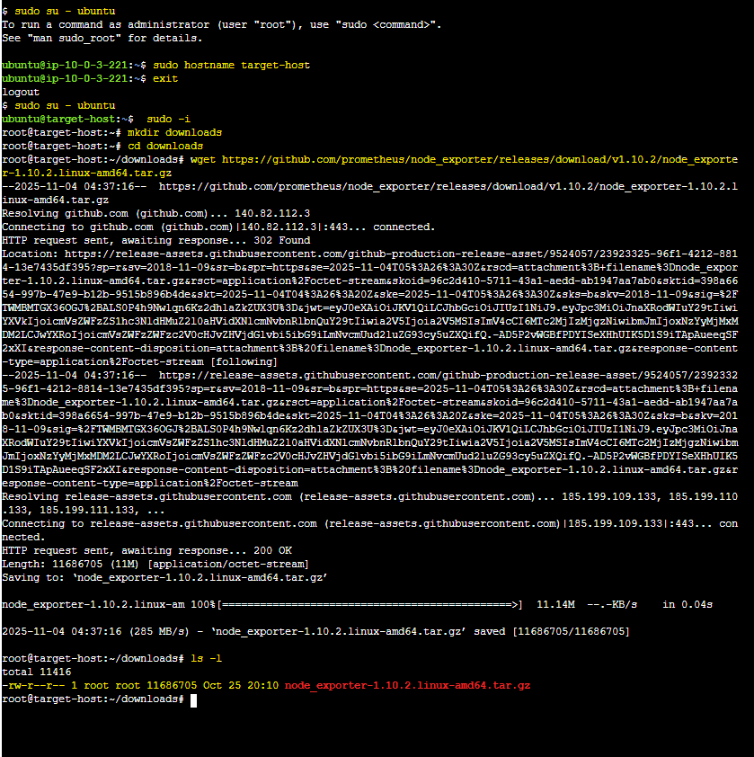

6. We will still create another folder called `node-exporters` just because we want our work to be organized. 
```
cd ..
```
```
mkdir node-exporters
```
```
cd node-exporters
```
7. Now let `unzip` it. We can first use the command help to see which command to use. `x = extract`, `f = the file you will like to extract`, `v = verbel in case of error message wil let you know` `z = for zip file`
```
tar -xvzf ~/downloads/node_exporter-1.10.2.linux-amd64.tar.gz
```
```
ls -l
```
9. Let rename our download prometheus `node_exporter-1.10.2.linux-amd64` into a simple name called `node_exporter`
```
mv node_exporter-1.10.2.linux-amd64 node_exporter
```
```
ls -l
```
10. let call the binary file `node-exporter` found inside our prometheus unzip file and check if node-exporter is install 
```
./node_exporter --version
```
11. Run node-exporter Binary with the command below 
```
./node_exporter
```
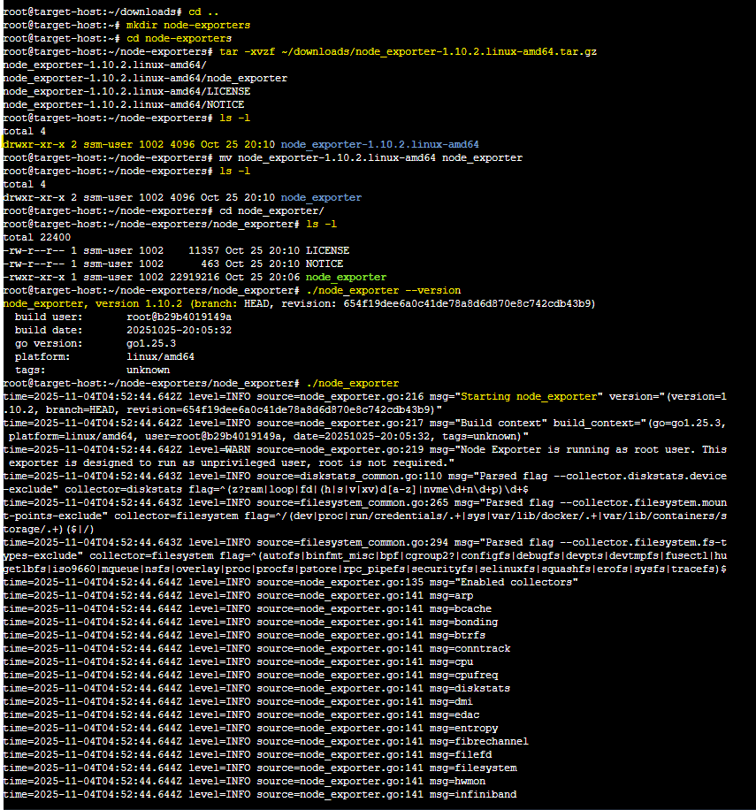

12. Node-exporter run by default on port `9100` So will need to update our `security group Inbound Rule ` agian. 
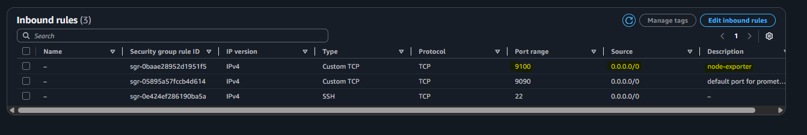

13. To be able to see the web url go to port `9100` by default using your `public ip address of your target-host ubuntu server`.
```
Public IPv4 address:9100
```
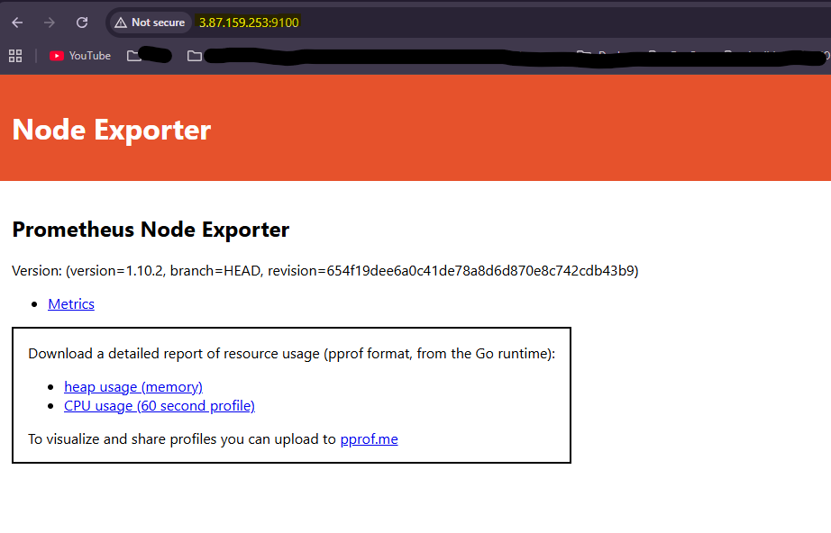

### We setup the Node Exporter but he's not yet link with our Prometheus Server. 
- So, we need to be in our Prometheus Server and go to our `Prometheus configuration file (prometheus.yml)` and create a new job called `node_exporter` our target on `scrape_configs` right at the bottom.
```
vi prometheus.yml
```
```
cat prometheus.yml
```
#### When you run the vi command above first thing to do is to press the "i" for insert. After deleting and pasting the pub-key you press the botton "Esc" ":wq!"
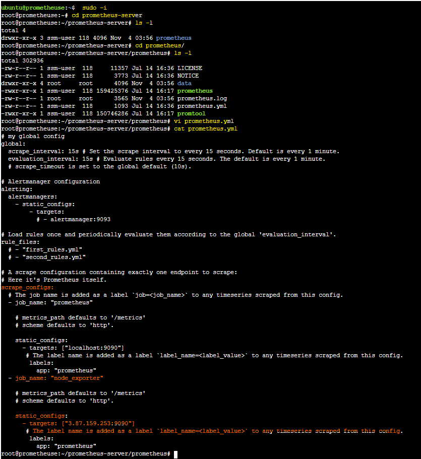


## Author
FOKOUE THOMAS
